# 全连接模型预测降雨量模型
*概述：以六盘山的降雨数据作为实验的初步数据，设计神经网络模型，按照历史数据来训练，预测2020年实验期间如果不加人工干扰的情况下的自然降水量，通过与实验期间的实际降雨量进行对比，分析带电粒子带来的实际效果。通过结果分析不断改善模型，将模型运用到乌鞘岭地区验证。*
## 六盘山地区
### 模型的选择
1. 由于降雨的物理原理非常复杂，随机性较强，所以选择使用神经网络来进行未加干扰情况下降雨量的预测。
2. 神经网络选择网络结构简单的全连接层作为初步的尝试。
3. 确定该模型要解决的是一个回归问题，目的在于预测出实验期间的自然降雨量。
### 降雨预测初步模型
1. 神经网络训练数据的确定
   1. 根据已有的数据，选择气压、温度、每小时降雨量、风速、风向作为features值，进行训练，目的是得到实验集的每小时降雨量。
   2. 选择训练集为2008年到2017年，验证集为2018-2019年，测试集为2020年，也就是实验期间
2. 模型效果
   1. 根据划分好的数据集和features进行训练，得到的训练结果如图所示。直观的发现，预测值比真实值小很多,分析原因知道，因为记录的是每小时的降雨量，这样就会有很多0值，淹没了有效信息。所以为了减少0值的比例，将预测目标的小时降雨量转换为预测日降雨量。
    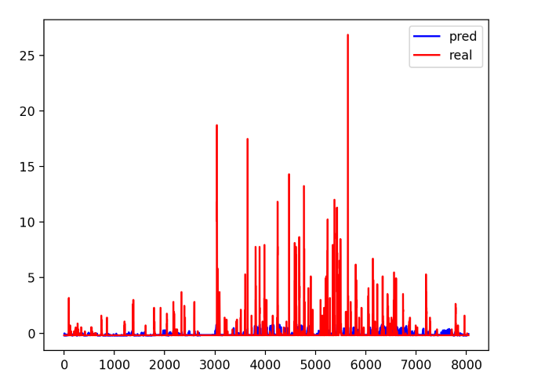 
   2. 按照每天进行重采样，以一天为间隔，24小时的雨量进行累加，得到日降雨量。将月、日也作为features加入集合中进行训练，压强等特征求24个观测点的平均值，使用重采样后的数据进行训练,效果好了很多。因为实际实验期是2020年的下半年，所以理论上，下半年的实际雨水应该更多一些，从图中可以看出这种趋势。
    
   3. 单从图像上看，实验的效果非常好，但是我们对模型没有进行评价，这样带来的降雨量的增加不能说明是进行人工降雨实验带来的，我们要尽量消去模型带来的误差，下面是训练过程中的loss曲线。可以看到，在训练的过程中，训练集的loss曲线波动较大，在最初的几轮训练中曲线下降比较明显，但是在之后的训练中，曲线比较曲折，上下起伏比较大，没有稳定在较低水平。而验证集的loss值虽有下降，但是下降幅度较小，一直维持在较高水平。这两者说明模型不仅在验证集中表现不好，甚至在训练集中都没有达到较好的效果，这说明我们的模型准确度和可信度不够。
    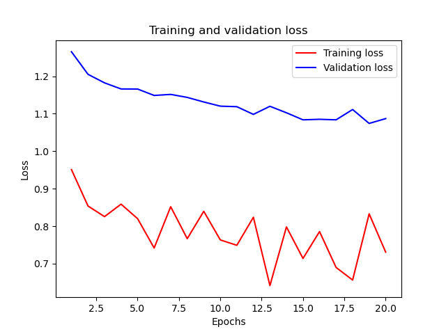
   4. 为了更加直观地看出模型自身带来的误差有多大，我们选用2019年的数据作为测试集，因为2019年没有进行人工降雨，所以理论上来说，好的模型的预测结果应该与实际降雨量基本吻合，我们就按照这种思路进行模型的检测，得到的2019年的预测降雨量和实际降雨量如下图，从图中我们可以看出即使2019年没有进行人工降雨实验，但是预测的降雨量还是很小，这样来看模型本身就会得出“实际降雨量比预测降雨量大的多”的结果，说明我们的模型不可信。我们再关注一下loss曲线，发现两条线趋势和2020年的loss曲线基本相同，这也有力地说明了当前地模型有很大的误差，我们接下来的工作在于努力改善这个模型，目标是让它对2019年的降雨量预测比较准确。
   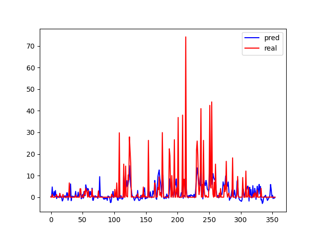 
   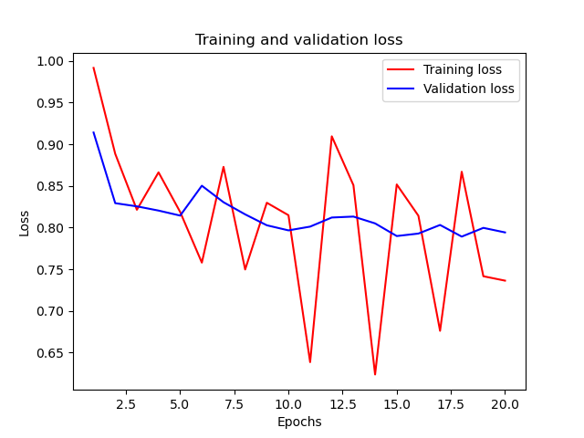
### 降雨模型修正
1. 我们首先分析，模型带来的误差是由什么引起的，下面是实验结果的具体值：
   1. 2019年1月到7月的真实降水量为491.00，使用模型预测的降水量是447.47，真实值与预测值相比，增加了9.73%
   2. 2019年8月到11月的真实降水量为508.20，使用模型预测的降水量为383.06，真实值与预测值相比，增加了32.67%
   3. 2019年的预测结果结果与实际结果的R-square值为0.21。
2. 从R-square的值可以知道模型的效果并不好。接下来进行具体分析：可以看到模型对下半年的误差比上半年大得多，再结合前边得到的降水量的图像，我们可以发现，每年的降水量的分布是不均匀的，因为我们预测的是每天的降水量，所以横轴就是一年中的每一天。我们可以看到，春冬季节降水量较小，大概在每年的第一百天左右开始，降水量突然增大，在200天左右达到峰值，100-250之间一直维持在较高水平。但是观察我们的预测值会发现，我们预测值随时间的变化并不明显，预测值一直在较低水平，也就是全年的每一天的降水量的预测值都比较低。由于实际上半年的降雨量也比较低，所以和预测值相比相差不大。但是下半年雨量的增多不能在模型的结果中表现出来，所以下半年的误差比较大。我们模型的主要问题在于，对于下半年的大雨量不能预测出来。
3. 因为降水量有季节差异，所以尝试将日雨量作为预测值的标准进一步修改，改为月雨量的预测，这样季节效应显示地更加明显。与之前每小时雨量改为日雨量类似，将日雨量按照月份累加，得到月雨量。将气压、湿度等求平均值作为每月的特征值，删去“日”这个特征，继续模型训练，得到的降雨量如下图所示。具体数据为：
   * 2019年全年月平均实际降水量为90.83，预测降水量为64.92，实际值比预测值大39.9%
   * 2019年1月到7月的月平均实际降水量为71.31，预测降水量为54.77，实际值比真实值大30.20%
   * 2019年8月到11月的月平均实际降水量为124.97，预测降水量为82.67，实际比预测值大51.17%
   * 模型的R-square值为0.55
   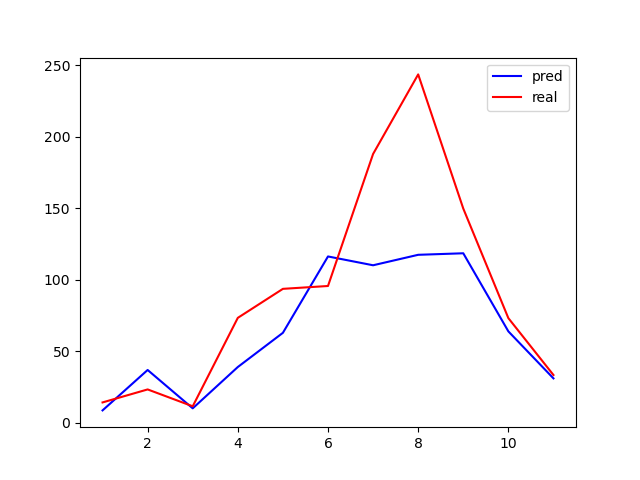 
   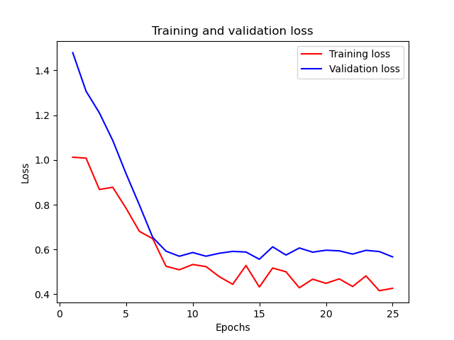
4. 从结果上来看，R-square的值依然很低，且不论上半年还是下半年的预测值都比实际值少很多。模型的loss值相比日降雨量的loss图像已经好了很多，训练前期下降明显，但是随着训练轮数的增加，validation-loss值一直保持在较高的水平。从降雨量图上看，预测值除了在2月左右有稍许偏高外，其他时间都低于实际值，尤其是8月份左右，实际雨量到达高峰，但是预测值仍保持在6月水平。分析原因可知，在8月左右发生了持续的降雨天气，但是模型并没有学到这一点，在模型认为6-9月降雨量都是差不多的，这与实际情况不符合。考虑到模型用到的特征值，我们猜想8月左右的强降雨天气不能被该模型识别，也就是说当前的特征的不足以让模型学会何时会发生强降雨。因此我们决定加入其他特征来进行训练，希望这些特征的加入，可以让模型“嗅”到强降雨到来前的味道。
5. 因为我们对降雨的机制不了解，我们已经将与降雨有关联的天气数据都加入进行了训练，所以没有哪个天气的特征值加入会让模型大幅度提升。实验之前进行方案设计时，设计了区域回归实验，也就是使用其他没做实验的站点作为参考，来预测实验地区的自然降水量。而我们当前的工作是用实验站点的历史数据来进行预测的，我们可以将区域回归实验融入进来，将其他站点的降雨量作为特征值。这些地方不但没有受到人工降雨的影响，而且与实验地区相距不远，且气候条件非常相似，对于8月份左右的强降雨天气也会有所反映。将他作为特征值进行训练，可以让模型知道8月份左右会有强降雨发生，从而改善模型的效果。
6. 我们首先加入隆德气象站的月降雨量作为模型的特征值进行训练，因为隆德气象站相聚六盘山气象站很近，降雨量也比较相近，得到的结果如下：
   * 2019年全年月平均实际降水量为90.83，预测降水量为85.41，实际值比预测值大6.34%
   * 2019年1月到7月的月平均实际降水量为71.31，预测降水量为63.57，实际值比真实值大12.18%
   * 2019年8月到11月的月平均实际降水量为124.97，预测降水量为123.62，实际比预测值大1.09%
   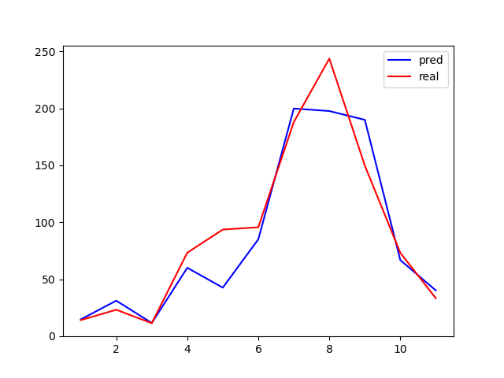 
   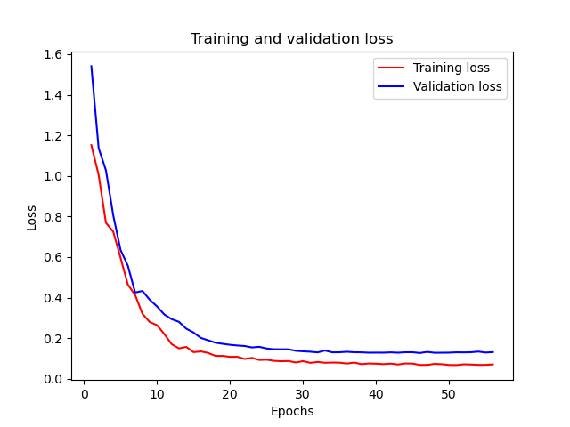
7. 我们可以清晰地看到，加入隆德站之后，模型对8月份左右的强降雨预测能力大幅度提升，月降雨图像比较吻合，loss图像中的训练集和验证集的loss值都下降到比较低的水平。再对实验数据进行详细分析，发现全年误差为6.34%，上半年的实际值大了12.18%，这一值是比较高的，从降雨图像上看，是五月份的降雨量的增加没有被预测到，甚至模型预测5月份的降水量相比四月份有所减少，这导致了上半年的预测值偏低。对于下半年来说，实际值比真实值大了1.09%，也就是说下半年的预测值和实际值相比几乎相同，这正是我们想要看到的效果。
8. 为了让上半年的误差进一步减小，我们再次加入泾源气象站的降雨数据作为训练特征进行训练，得到的训练结果如下所示。
   * 2019年全年月平均实际降水量为90.83，预测降水量为89.11，实际值比预测值大1.93%
   * 2019年1月到7月的月平均实际降水量为71.31，预测降水量为66.47，实际值比真实值大7.27%
   * 2019年8月到11月的月平均实际降水量为124.97，预测降水量为123.62，实际比预测值大-2.90%
   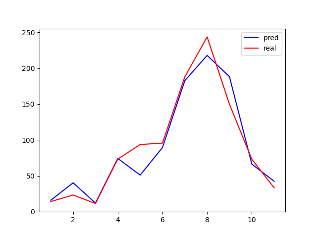 
   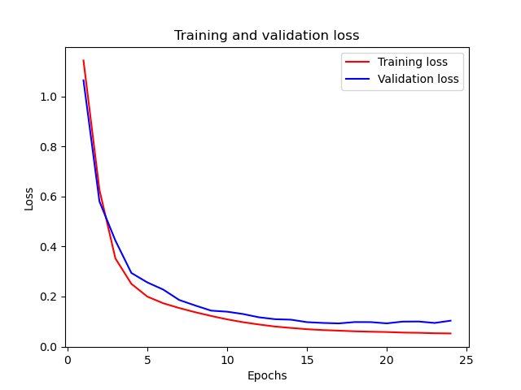
9. 可以看到，再次加入泾源站之后，全年误差从6.34%降低到了1.93%，上半年的误差从12.18%降低到了7.27%，而下半年的误差略有增加，从+1.09%到-2.90%，但是相差不大，与带来的上半年误差的降低相比，下半年误差的小幅度增加可以接受。而且加入泾源后，模型对下年的预测值是略大于实际值的，这样的话，当进行2020年实验时，若得到结果实际值偏大时，说明这不是模型带来的误差。因为模型的误差是会让预测值偏大的，结果却是偏大的预测值仍然比实际值要低，这样就可以更好的说明降雨量的增加是带电粒子催化降雨实验带来的结果。从loss图上看，训练集和验证集的loss曲线都明显下降到较低水平，比较理想。
### 使用模型
1. 使用加入固原和泾源气象站月降雨量的模型，对六盘山气象站2020年的降雨量进行预测。训练集为2008年到2017年的数据，包括三个站的降雨数据以及六盘山气象站的气压、温度、湿度、风速、风向，使用这些数据进行训练，使用2018年到2019年的降雨量进行验证，来得到最终需要的2020年的降水量的预测值。结果如下。
   * 2020年全年月平均实际降水量为85.81，预测降水量为79.03，实际值比预测值大8.5%
   * 2020年1月到7月的月平均实际降水量为64.96，预测降水量为64.82，实际值比真实值大0.21%
   * 2020年8月到11月的月平均实际降水量为122.30，预测降水量为103.99，实际比预测值大17.60%
   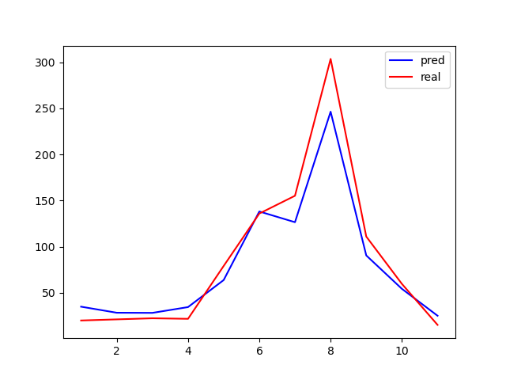 
   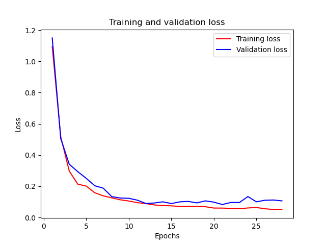
2. 分析结果，可以看到全年的降水量实际值比预测值是大的，在保证预测值是可靠的前提下，这个结果是我们希望看到的。
   1. 观察降雨增量的具体分布，看到2020年1月到7月预测值和真实值只相差0.21%，因为这期间没有进行实验，所以预测值和真实值理论上来说应该是相同的，这一数据也证明了这一点，再次证明了模型是可靠的。
   2. 下半年实际值比预测值大了17.60%，这说明下半年的降雨受到了除自然降雨以外的影响，也就是我们的实验起了效果。再结合之前预测2019年下半年降雨的结果来看，该模型会对下半年降雨量的预测值偏高，预测值比实际值高2%左右。但是在2020年，预测值与实际值低了17.60%，所以再考虑上模型的误差，这个实际值增加17.60%的这个值会更大，为20%左右。
   3. 以上说明我们在下半年开展的实验使六盘山地区的降雨量增加了20%左右。
### 检验日雨量
1. 以上模型预测了2020年的月雨量，效果很好。在一步步改善模型的过程中，我们发现，固原、泾源气象站降雨量的加入，会让模型得到大幅度的提升。现在，我们重新着眼于日雨量，希望通过加入两个气象站降水量数据的模型可以成功地预测出日雨量。
2. 对模型的训练数据进行相应的调整，将月雨量修改为日雨量，训练的特征值选为三个站的日雨量、月份、日、气压、温度、湿度、风速、风向，先预测2019年的降雨量，来检验模型的效果。结果如下：
   * 2019年全年的日平均实际降雨量为2.81，预测降雨量为2.86，实际值比预测值大-1.58%
   * 2019年1月到7月的日平均实际降雨量为2.35，预测降雨量为2.29，实际值比预测值大2.83%
   * 2019年8月到12月的日平均实际降雨量为3.50，预测降雨量为3.71，实际值比预测值大-5.63%
   * 2019年的日降雨量的预测值和实际值的R-square值为0.91
   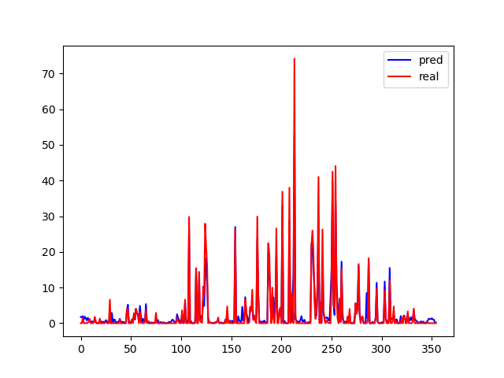 
   
3. 分析结果，2019年的全年降水量的预测值和实际值相差1.58%，理想情况下该值应该接近0，但是这个数值不大，说明该模型比较合适。
   1. 实验的预测值与实际值的R-square值为0.91，这说明预测值和实际值关联性很强，因为我们的目标是预测值和实际值相等，所以这个值越大越好。
   2. 上半年的实际值比预测值大2.83%，数值较低，说明上半年的预测比较准确。
   3. 下半年的实际值比预测值低了5.64%，这个值相对来说比较大，但是考虑到预测结果比实际结果是要高的，这说明模型不会得到较低的预测值来使实际值看起来虚高。如果结果如我们所愿，实际值更大，这是比偏高的预测值还要大，更有力地说明我们实验的有效性。
   4. 从图像上看，日雨量的分布比较吻合，这说明该模型确实可以对日雨量也做出很好的预测。而训练过程中的loss曲线也下降明显，最后接近0值，这些都说明模型比较成功。
4. 使用该日雨量模型对2020年的全年日雨量进行预测，结果如下。
   * 2020年全年的日平均实际降雨量为2.82，预测降雨量为2.71，实际值比预测值大3.92%
   * 2019年1月到7月的日平均实际降雨量为2.14，预测降雨量为2.25，实际值比预测值大-5.18%
   * 2019年8月到12月的日平均实际降雨量为4.01，预测降雨量为3.51，实际值比预测值大14.19%
   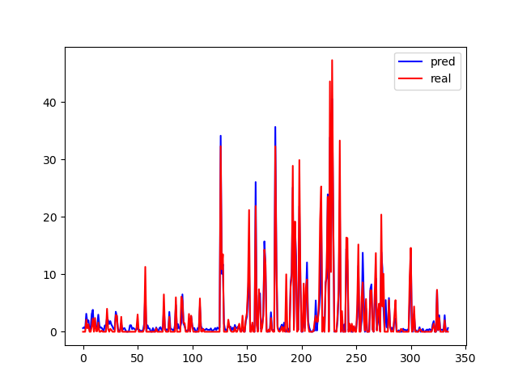 
   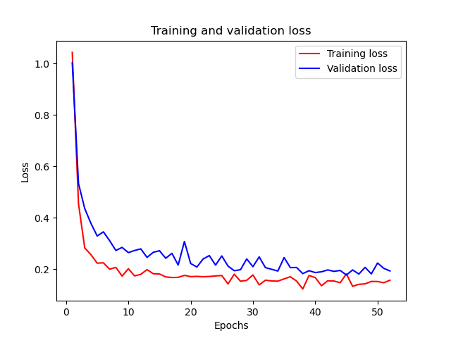
5. 分析结果
   1. 综合2019年的结果，可以看到2019年的上半年预测值小了2.83%；在2020年，预测值大了5.18%；同时2019上半年的实际日降水量平均值为2.81，2020年为2.13。这两项数值表明，2020年上半年的雨量比2019年是有所降低的，(2.13-2.35)/2.35=-9.36%，即大概降低9.36%，也就是说自然降雨的影响下，2020年的上半年比2019年的雨水偏少，这样导致了2020年的预测值会有些偏大。
   2. 2020年下半年的实际降水量比预测值高了14.19%，我们注意到2019年的模型中下半年预测值大了5.63%，也就是说，该模型得到的下半年的预测值会偏高5%左右。假设模型在2020年下半年也有该误差，则扣除误差，增量大概为14%+5.63%=19.63%
   3. 按照实际值来看，下半年的实际日降雨量为4.01，而2019下半年的实际日降雨量为3.50，增加了14.57%，而根据上半年显示2020雨水少，上半年减少了9.36%，假设下半年也会减少9.36%，实际却增加14.57%，这表示降雨效果达到了9.36%+14.57%=23.93%。
   4. 两个方面的证据都表示降雨的增加会达到20%
6. 我们再来分析一下2020年的降水量的残差图，该图显示的数据是用真实值减去预测值得来的。如下所示。可以看到，上半年的残差变化比较小，维持在0值附近，下半年的起伏比较大，而多为正值，这是实验带来的结果，这一图非常直观。
   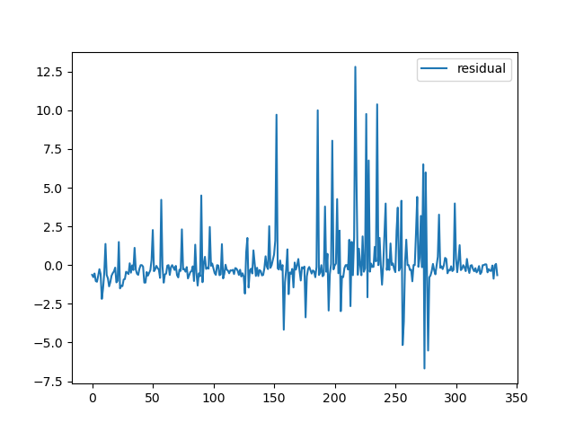 
### 六盘山全连接模型总结
1. 想预测出一个气象站的降雨量，其他气象站的降雨数据非常重要。仅仅从气压、温度、湿度、风等当地的自然气象条件很难判断出降雨的强弱。
2. 实验模型对日雨量和月雨量都进行了研究，在两个方面都得到了实验期间降水量增加了20%左右的结论。
3. 实验模型有2019作为检测，具有比较高的可信度。且在2020年预测效果也符合预期。