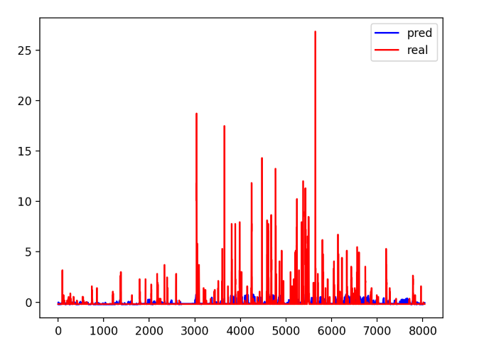
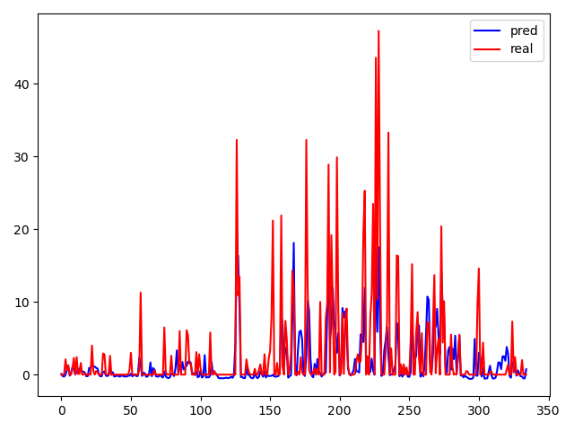
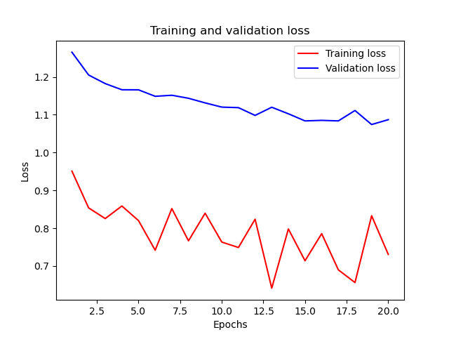
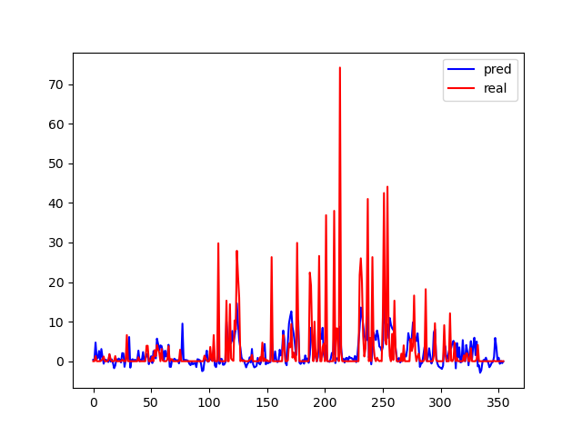
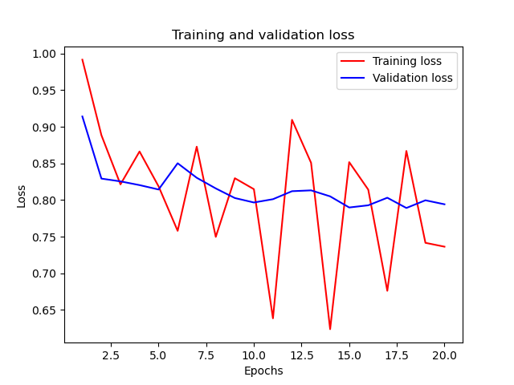

#  全连接模型预测降雨量模型
  
*概述：以六盘山的降雨数据作为实验的初步数据，设计神经网络模型，按照历史数据来训练，预测2020年实验期间如果不加人工干扰的情况下的自然降水量，通过与实验期间的实际降雨量进行对比，分析带电粒子带来的实际效果。通过结果分析不断改善模型，将模型运用到乌鞘岭地区验证。*
##  六盘山地区
  
###  模型的选择
  
1. 由于降雨的物理原理非常复杂，随机性较强，所以选择使用神经网络来进行未加干扰情况下降雨量的预测。
2. 神经网络选择网络结构简单的全连接层作为初步的尝试。
3. 确定该模型要解决的是一个回归问题，目的在于预测出实验期间的自然降雨量。
###  六盘山降雨预测初步模型
  
1. 神经网络训练数据的确定
   1. 根据已有的数据，选择气压、温度、每小时降雨量、风速、风向作为features值，进行训练，目的是得到实验集的每小时降雨量。
   2. 选择训练集为2008年到2017年，验证集为2018-2019年，测试集为2020年，也就是实验期间
2. 模型效果
   1. 根据划分好的数据集和features进行训练，得到的训练结果如图所示。直观的发现，预测值比真实值小很多,分析原因知道，因为记录的是每小时的降雨量，这样就会有很多0值，淹没了有效信息。所以为了减少0值的比例，将预测目标的小时降雨量转换为预测日降雨量。
     
   2. 按照每天进行重采样，以一天为间隔，24小时的雨量进行累加，得到日降雨量。将月、日也作为features加入集合中进行训练，压强等特征求24个观测点的平均值，使用重采样后的数据进行训练,效果好了很多。因为实际实验期是2020年的下半年，所以理论上，下半年的实际雨水应该更多一些，从图中可以看出这种趋势。
    
   3. 单从图像上看，实验的效果非常好，但是我们对模型没有进行评价，这样带来的降雨量的增加不能说明是进行人工降雨实验带来的，我们要尽量消去模型带来的误差，下面是训练过程中的loss曲线。可以看到，在训练的过程中，训练集的loss曲线波动较大，在最初的几轮训练中曲线下降比较明显，但是在之后的训练中，曲线比较曲折，上下起伏比较大，没有稳定在较低水平。而验证集的loss值虽有下降，但是下降幅度较小，一直维持在较高水平。这两者说明模型不仅在验证集中表现不好，甚至在训练集中都没有达到较好的效果，这说明我们的模型准确度和可信度不够。
    
   4. 为了更加直观地看出模型自身带来的误差有多大，我们选用2019年的数据作为测试集，因为2019年没有进行人工降雨，所以理论上来说，好的模型的预测结果应该与实际降雨量基本吻合，我们就按照这种思路进行模型的检测，得到的2019年的预测降雨量和实际降雨量如下图，从图中我们可以看出即使2019年没有进行人工降雨实验，但是预测的降雨量还是很小，这样来看模型本身就会得出“实际降雨量比预测降雨量大的多”的结果，说明我们的模型不可信。我们再关注一下loss曲线，发现两条线趋势和2020年的loss曲线基本相同，这也有力地说明了当前地模型有很大的误差，我们接下来的工作在于努力改善这个模型，目标是让它对2019年的降雨量预测比较准确。
    
   
###  六盘山降雨模型修正
  
1. 我们首先分析，模型带来的误差是由什么引起的，下面是实验结果的具体值：
   1. 2019年1月到7月的真实降水量为491.00，使用模型预测的降水量是447.47，真实值与预测值相比，增加了9.73%
   2. 2019年8月到11月的真实降水量为508.20，使用模型预测的降水量为383.06，真实值与预测值相比，增加了32.67%
2. 可以看到模型对下半年的误差比上半年大得多，再结合前边得到的降水量的图像，我们可以发现，每年的降水量的分布是不均匀的，因为我们预测的是每天的降水量，所以横轴就是一年中的每一天。我们可以看到，
  
  
  
  
  
  
  
  
  
  